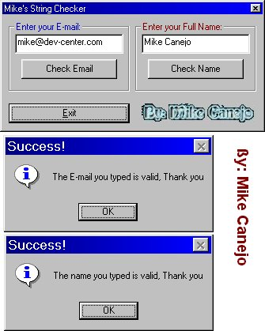



## Mike's String Checker

### Description

This shows you how to search for a "string" inside of a "string" to see if it's there or not. This makes a good E-mail validator.. If the user doesn't put the "@" character, this will know it's not there and return false. This also works the same way if your trying to validate a Full Name. I commented everyline so enjoy and good luck.   -Mike
 
### More Info
 

             |
---                |---
**Submitted On**   |2000-01-31 20:59:44
**By**             |[Michael L\. Canejo](https://github.com/Planet-Source-Code/PSCIndex/blob/master/ByAuthor/michael-l-canejo.md)
**Level**          |Beginner
**User Rating**    |3.5 (14 globes from 4 users)
**Compatibility**  |VB 4\.0 \(32\-bit\), VB 5\.0, VB 6\.0
**Category**       |[String Manipulation](https://github.com/Planet-Source-Code/PSCIndex/blob/master/ByCategory/string-manipulation__1-5.md)
**World**          |[Visual Basic](https://github.com/Planet-Source-Code/PSCIndex/blob/master/ByWorld/visual-basic.md)
**Archive File**   |[CODE\_UPLOAD57065112000\.zip](https://github.com/Planet-Source-Code/michael-l-canejo-mike-s-string-checker__1-8021/archive/master.zip)

